# visualization_of_CNN_feature_maps

I have based my implementation on : 
- https://cs.nyu.edu/~fergus/drafts/deconv_iccv_names.png
- https://ieeexplore.ieee.org/document/5539957
- https://cs.nyu.edu/~fergus/papers/zeilerECCV2014.png

I have expanded their work to cover a niche topic in representation learning known as Neural Collapse a phenomena of the geometry of learned solutions for Deep classifiers. 
This is the original Neural Collapse Paper - Prevelance of Neural Collapse in the Terminal Phase of Training
https://arxiv.org/png/2008.08186

This is part of an ongoing work in understanding the Transferability of features learned by networks driven to neural collapse

# Model Architecture 

## Neural Collapse Measurements for both backbones I trained : 

note NC-3 is measured in the classifier (post FC3 activations - M and W from classifier ) 
note NC-1 is measured post BN and post ReLU 

Both Models are trained on rotated images of CIFAR10 with equal class representation for each rotation in 0deg, 90deg, 180deg, 270deg
Both models are trained for 50 epochs on mini-batches of 32 images

| HyperParam | Collapsed | Not Collapsed |
|--------|--------|--------|
| Weight Decay | 2e-4 | 0 |
| LR | 0.01 | 0.01 |

NC-1 Regularization (Penalty) weights applied in the loss for the not-collapsed backbone

| Layer | Penalty |
|---------|---------:|
| conv1 | 0.005 |
| conv2 | 0.005 |
| conv3 | 0.010 |
| conv4 | 0.010 |
| conv5 | 0.010 |
| conv6 | 0.020 |
| conv7 | 0.020 |
| conv8 | 0.020 |
| conv9 | 0.040 |
| lin1 | 0.001 |
| lin2 | 0.001 |
| lin3 | 0.001 |
| classifier | 0.0005 |

### Collapsed 

NC-3: 0.4042

Test Accuracy: 88.88%
Train Accuracy: 98.58%

'bn1': 1027.768
'bn2': 655.4315
 'bn3': 94.9738
'bn4': 44.6072
'bn5': 33.6091
'bn6': 27.9340
 'bn7': 24.3828
'bn8': 22.5607
'bn9': 12.9483
'fc3': 0.1145
'Classifier': 0.0334 

### Not-collapsed

NC3: 1.1470

Test Accuracy: 67.25%
Train Accuracy: 98.74%

{'bn1': 30368.2578,  
'bn2': 295634.8438,  
'bn3': 77364.5234,  
'bn4': 147873.2500,  
'bn5': 327054.8750,  
'bn6': 238458.2188,  
'bn7': 133812.7031,  
'bn8': 203219.5781,  
'bn9': 3570.1660,  
'fc3': 1.2956, 
 'classifier': 0.0496, }

# Example of Result (270 deg rotation ):  

## Collapsed

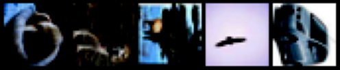
### Conv 1
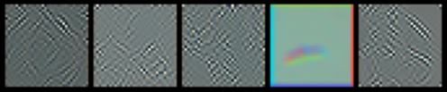
### Conv 2
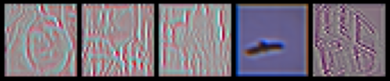
### Conv 3
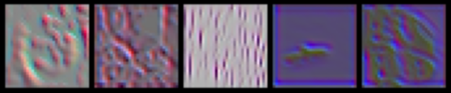
### Conv 4
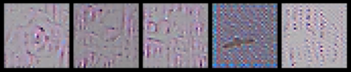
### Conv 5
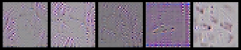
### Conv 6
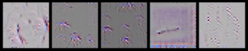
### Conv 7
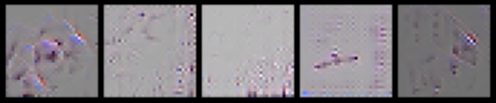
### Conv 8
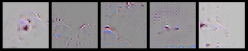
### Conv 9
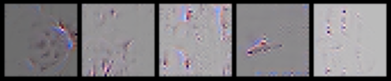

## Not Collapsed
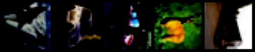
### Conv 1
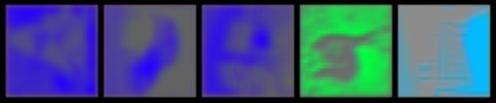
### Conv 2
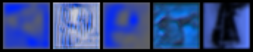
### Conv 3
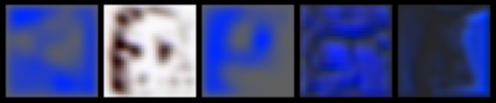
### Conv 4
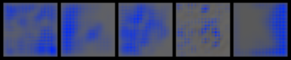
### Conv 5
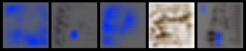
### Conv 6
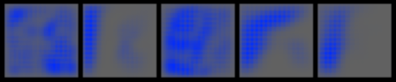
### Conv 7
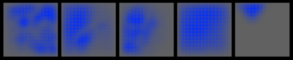
### Conv 8
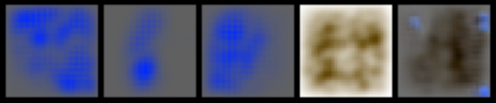
### Conv 9
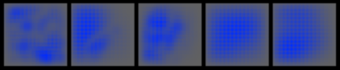
